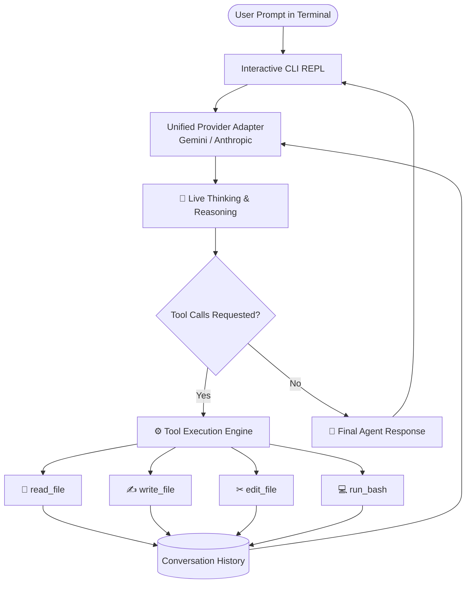

# 🤖 Terminal-Based Coding Agent

> A mini, autonomous terminal coding agent inspired by **Claude Code**, written in **TypeScript / JavaScript** and powered by **Anthropic Claude** and **Google Gemini**.

---

## 📌 Overview

The **Terminal Coding Agent** is an interactive command-line developer assistant that lives directly in your shell. It operates directly on your local workspace to inspect repositories, read code, perform precise edits, create new files, run bash commands (test suites, linters, git), and autonomously verify its work.

Unlike generic chat assistants, it features a complete **ReAct (Reasoning + Action) execution loop**:
1. **Perceives** user intent and workspace state.
2. **Thinks transparently** — displaying its step-by-step reasoning and strategy directly in your terminal.
3. **Calls tools** autonomously to read, edit, or execute.
4. **Inspects output** and self-corrects until the task is complete.

---

## ✨ Features (v1)

- 🧠 **Dual LLM Provider Support**:
  - **Google Gemini** (powered by `@google/genai` with `gemini-3.6-flash` and thinking mode).
  - **Anthropic Claude** (powered by `@anthropic-ai/sdk` with `claude-3-7-sonnet` / `claude-3-5-sonnet` and extended thinking).
  - Automatically switches based on available API keys or user configuration.
- 💭 **Transparent Thinking**:
  - Live terminal visualization of the model's internal thoughts and reasoning process before it executes any actions.
- 🛠️ **Autonomous Tool Calling**:
  - `read_file`: Inspect contents of any file in the workspace.
  - `write_file`: Create new files (automatically creating parent subdirectories).
  - `edit_file`: Precise search-and-replace edits without rewriting or truncating large files.
  - `run_bash`: Execute shell commands (e.g. `npm test`, `git status`, `python script.py`, `ls`).
- 💻 **Terminal-First UX**:
  - Interactive REPL loop with rich color output (Chalk) and live spinners (Ora).
  - Session history persistence across turns with `/clear` context reset and `exit` commands.
- 📁 **Zero IDE Dependency**:
  - Operates standalone on any folder or code repository, outputting clean changes across `.tsx`, `.ts`, `.py`, `.json`, or any other extension.

---

## 🏗️ Architecture



---

## 🚀 Quick Start

### 1. Prerequisites
- **Node.js** >= 18.0.0
- **npm** or **pnpm** / **yarn**
- An API key for either **Google Gemini** or **Anthropic Claude** (or both!)

### 2. Installation & Setup

Clone the repository and install dependencies:

```bash
git clone https://github.com/ratnadeep2003/terminal-based-coding-agent.git
cd terminal-based-coding-agent
npm install
```

### 3. Configure API Keys

Create a `.env` file in the project root:

```env
# Provide at least one of the following keys:
GEMINI_API_KEY="your-gemini-api-key-here"
ANTHROPIC_API_KEY="your-anthropic-api-key-here"

# Optional: Set preferred provider ("gemini" or "anthropic")
DEFAULT_PROVIDER="gemini"
```

### 4. Build the Project

Compile TypeScript to JavaScript:

```bash
npm run build
```

### 5. Run the Agent

Start the agent interactively:

```bash
# Development mode (runs directly via tsx)
npm run dev

# Or run the compiled build
npm start
```

To install the agent globally on your machine so you can run `code-agent` from any directory:

```bash
npm run build
chmod +x dist/index.js
npm link
code-agent
```
---

## 💡 Usage Example

Once inside the interactive terminal session:

```text
=============================================
         🤖 Terminal Coding Agent            
 Working directory: /path/to/my-project
 Type 'exit' to quit, or '/clear' to reset.
=============================================

You: Add a new helper function to utils.ts that formats dates as ISO strings, and verify it with a test.

💭 Thinking:
The user wants to add a date formatting function in utils.ts.
1. First, I should read utils.ts to understand the existing code and style.
2. Next, use edit_file to append the formatDateToISO function.
3. Then, run tests using run_bash to confirm no regressions.

⚙ Tool Call: read_file({"path":"src/utils.ts"})
↳ Output: export function add(a: number, b: number) { return a + b; }...

💭 Thinking:
utils.ts currently only has basic math helpers. I will use edit_file to append the new function.

⚙ Tool Call: edit_file({
  "path": "src/utils.ts",
  "target": "export function add(a: number, b: number) { return a + b; }",
  "replacement": "export function add(a: number, b: number) { return a + b; }\n\nexport function formatDateToISO(date: Date): string {\n  return date.toISOString();\n}"
})
↳ Output: Successfully updated src/utils.ts

Agent:
I have added the `formatDateToISO` helper function to `src/utils.ts`.
```

---

## 🛠️ Built-in Tools (v1)

| Tool | Parameters | Description |
| :--- | :--- | :--- |
| `read_file` | `path: string` | Reads and returns the complete utf-8 contents of a file. |
| `write_file` | `path: string`, `content: string` | Writes or overwrites a file. Automatically creates any missing parent directories. |
| `edit_file` | `path: string`, `target: string`, `replacement: string` | Replaces an exact block of code with new content. Fails safely if target isn't found. |
| `run_bash` | `command: string` | Executes a shell command and captures `stdout` and `stderr`. |

---

## 📁 Project Structure

```text
terminal-based-coding-agent/
├── src/
│   ├── index.ts        # CLI entry point, readline REPL loop, & Ora spinner UX
│   ├── provider.ts     # Unified LLM provider (Gemini & Anthropic with thinking)
│   └── tools.ts        # Tool declarations & safe execution handlers
├── dist/               # Compiled JavaScript bundle
├── docs/
│   └── PLAN.md         # Multi-phase roadmap & feature plans
├── package.json        # Dependencies & executable binary declaration
├── tsconfig.json       # TypeScript compiler configuration
└── README.md           # Documentation
```

---

## 🗺️ Roadmap

- [x] **v1: Core Autonomous Terminal Agent**
  - [x] ReAct perception & action loop
  - [x] Interactive CLI with history & terminal styling
  - [x] Multi-provider support (Gemini + Anthropic)
  - [x] Transparent thinking visualization
  - [x] Targeted file editing (`edit_file`) & auto-directory creation
- [ ] **v2: IDE & Version Control Integrations**
  - [ ] VS Code and external editor synchronization
  - [ ] GitHub automation (clone, branch, commit, push, PR creation)
  - [ ] Automated change summary generation (e.g. LinkedIn / release posts)
- [ ] **v3: Self-Improving Agent**
  - [ ] Error reflection memory
  - [ ] Self-correction on failed tool executions & test runs
  - [ ] Agent skill synthesis

---
